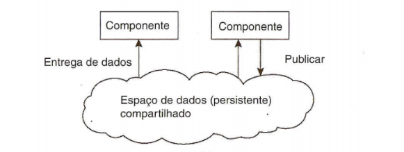
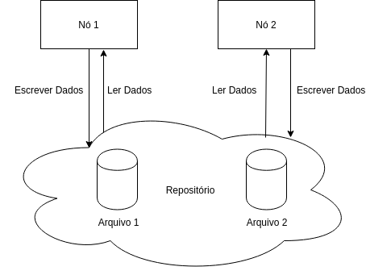
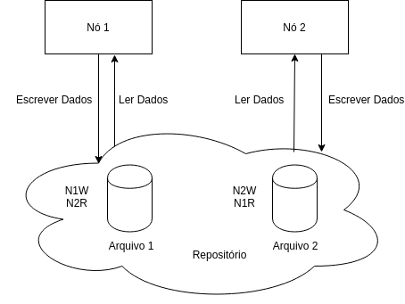
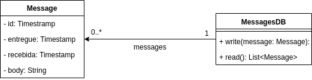
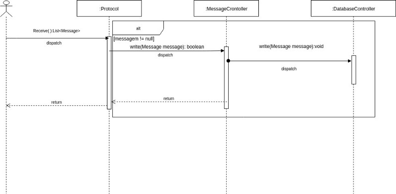
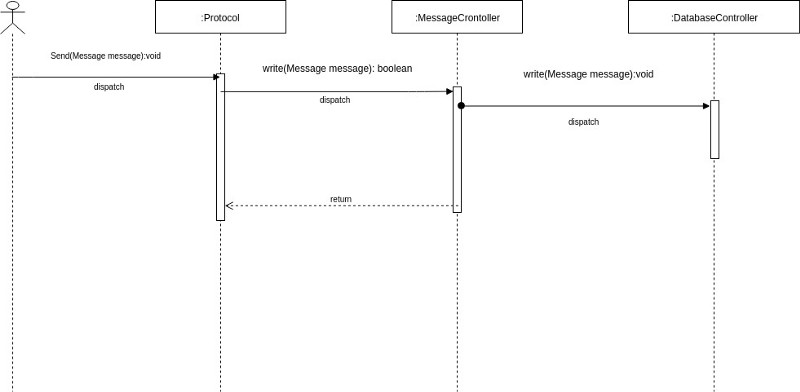
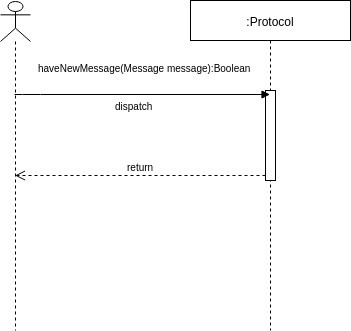
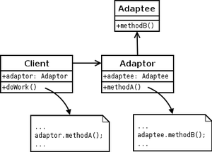

Este trabalho descreve o processo para a especificação de um protocolo para implementação de um sistema de chat utilizando o estilo arquitetural de espaço de dados compartilhado.

Estilo arquitetônico de espaço de dados compartilhados. Fonte: TANEBAUM, 2007

Este espaço de dados compartilhado será chamado de repositório durante este trabalho.

Para este trabalho definiu-se que o repositório seria constituído de dois arquivos com regras específicas como pode ser visto no diagrama abaixo:

Representação da arquitetura do projeto. Fonte: Autoria Própria, 2018

As regras para leitura e escrita de dados são as seguintes:

*   O nó 1 pode apenas escrever o arquivo 1;
*   O nó 1 pode apenas ler o arquivo 2;
*   O nó 2 pode apenas escrever o arquivo 2;
*   O nó 2 pode apenas ler o arquivo 1;

Assim o diagrama ficará desta forma:

Representação da arquitetura do projeto com restrições de leitura e escrita. Fonte: Autoria Própria, 2018

Onde N1 e N2 representam o nó 1 e 2 respectivamente e R e W representam _read_(leitura) e _write_(escrita) respectivamente, logo N1W significa que o nó 1 pode escrever neste arquivo.

Tendo definido este cenário surgem alguns problemas:

1 — Como saber quando a mensagem chegou?

2 — Como saber quando a mensagem foi entregue?

3 — O que fazer com os dados recebidos e enviados no repositório?

4 — Supondo que N1 e N2 façam leitura e escrita ao mesmo tempo, como comportar-se (em N1 e Nx)?

Ao analisar estes problemas definiu-se que a comunicação entre os nós seria síncrona que, para este projeto, significa dizer que quando um nó enviar uma mensagem este não poderá enviar uma nova mensagem até que o outro nó envie uma mensagem para ele. Com base nessa restrição montou-se o diagrama classes para realiza a comunicação entre os nós:

Diagrama de classes simples. Fonte: Autoria Própria, 2018

Assim **definiu-se que cada arquivo conterá uma lista de objetos do tipo mensagem** e que **será usado apenas os atributos deste objeto para informar o estado atual do sistema**. Ao não utilizar nenhuma estratégia mais complexa espera-se que seja possível portar este repositório para qualquer plataforma sem problemas, por exemplo, esta arquitetura funcionará da mesma forma se utilizar, por exemplo, arquivos no Google Drive, Dropbox, em uma máquina local ou servidor de compartilhamento próprio.

Tendo em vista estas decisões definiu-se que o fluxo da comunicação entre os nós será da seguinte forma: sempre que um nó for enviar uma mensagem deve verificar se não existem novas mensagens no arquivo onde ele tem permissão de leitura, caso não haja ele deve criar um objeto do tipo _Message_ definindo o atributo _body_ com o corpo da mensage e o atributo _Id_ com o _Timestamp_ do momento em que o objeto foi criado, depois disto ele deve adicionar este objeto na lista de mensagens no arquivo que ele possui permissão de leitura e aguardar uma resposta, este objeto não pode enviar nenhuma nova mensagem até que o outro nó envie uma nova mensagem.

Quando um nó percebe que há uma nova mensagem no arquivo que ele pode ler deve reescrever o objeto _Message_ da nova mensagem no arquivo que ele tem permissão de escrita definido o atributo entregue e quando a mensagem for lida deve atualizar este objeto com o atributo _lida_. O primeiro nó só poderá enviar uma nova mensagem quando este enviar uma mensagem no arquivo onde pode escrever e então este processo se repete.

**Note que aqui não nos preocuparemos com o problema de sincronia do relógio das máquinas para geração e comparação dos atributos de tipo _TimeStamp._**

Adotando este algoritmo resolve-se os problemas propostos anteriormente da seguinte forma:

1 — **_Como saber quando a mensagem chegou?_** O nó, assim que receber a mensagem, deve reescrever o objeto da mensagem porém no seu arquivo (o arquivo onde tem permissão de escrita) e definindo a propriedade _recebida._

2 — **_Como saber quando a mensagem foi entregue?_** O nó, assim que ler a mensagem, deve atualizar o objeto da mensagem em seu arquivo (o arquivo onde tem permissão de escrita) definido o atributo entregue.

3 —**_ O que fazer com os dados recebidos e enviados no repositório?_** Todos os dados enviados para o repositório serão mantidos enquanto o chat estiver aberto, tal decisão torna possível até montar um histórico do chat. Quando o chat for finalizado os arquivos devem ser limpos.

4 —**_Supondo que N1 e N2 façam leitura e escrita ao mesmo tempo, como comportar-se (em N1 e N@)?_** Como a comunicação é síncrona e cada nó escreve em um arquivo não existe o problema de escrita concorrente porém ainda há um problema. Na primeira mensagem se ambos os nós, ao mesmo tempo, lerem o arquivo onde tem permissão de leitura e não haverá nenhuma mensagem o que significa que ambos podem enviar uma mensagem, se isto for feito ao mesmo tempo então haverá um bloqueio pois cada nó esperará uma resposta do outro nó infinitamente já que nenhum deles poderá responder a mensagem. Para solucionar isto existe o atributo Id no objeto mensagem (este atributo representa o _Timestamp_ no momento em que a mensagem foi enviada), quando o nó escrever uma mensagem no seu arquivo e, ao ler o arquivo do outro nó perceber que também há uma mensagem cada nó deve executar o seguinte processo:

*   Caso o Id da última mensagem do repositório onde o nó pode ler **seja igual** ao Id da última mensagem enviada pelo nó **então este espera um tempo aleatório entre 0 e 10 segundos**, após este tempo ele deve ler o arquivo e se não houver novas mensagem este pode enviar sua mensagem, **caso os Ids se repitam novamente este processo é refeito**.
*   Caso o Id da última mensagem do repositório onde o nó Caso o Id da última mensagem do repositório onde o nó pode ler **seja diferente** do Id da última mensagem enviada pelo nó então **é considerado a mensagem mais antiga** como a primeira mensagem do chat e a outra nova deve aguardar o processamento para que seja reenviada.

**1 — Descrevendo o monitoramento:** Uma comunicação entre os nós síncrona, quando um nó enviar uma mensagem este não poderá enviar uma nova mensagem até que o outro nó envie uma mensagem para ele. Assim cada arquivo conterá uma lista de objetos do tipo mensagem e que será usado apenas os atributos deste objeto para informar o estado atual do sistema. A comunicação será da seguinte forma: sempre que um nó for enviar uma mensagem deve verificar se não existem novas mensagens no arquivo onde ele tem permissão de leitura, caso não haja ele deve criar um objeto do tipo _Message_, depois disto ele deve adicionar este objeto na lista de mensagens no arquivo que ele possui permissão de leitura e aguardar uma resposta, este objeto não pode enviar nenhuma nova mensagem até que o outro nó envie uma nova mensagem. Quando um nó percebe que há uma nova mensagem no arquivo que ele pode ler deve reescrever o objeto _Message_ da nova mensagem no arquivo que ele tem permissão de escrita definido o atributo entregue e quando a mensagem for lida deve atualizar este objeto com o atributo lida. O primeiro nó só poderá enviar uma nova mensagem quando este enviar uma mensagem no arquivo onde pode escrever e então este processo se repete.

**2 — Descrever a estruturação dos dados e a definição de tipos de estruturas:** _O objeto Message_ é o centro da comunicação entre os nós, tal objeto possui os seguintes atributos:

*   atributo _body_ contém o corpo da mensagem;
*   atributo Id contém o _Timestramp_ do momento em que o objeto foi criado se houver caso que na primeira;
*   atributo lida que contém o _Timestramp_ com o momento em que a mensagem foi lida/aberta;
*   e o atributo entregue _que contém o Timestramp_ do momento em que a mensagem foi recebida.

**3 — Explicar o fluxo de envio de uma mensagem:** Sempre que um nó for enviar uma mensagem deve verificar se não existem novas mensagens no arquivo onde ele tem permissão de leitura, caso não haja ele deve criar um objeto do tipo _Message_ definindo o atributo _body_ com o corpo da mensagem e o atributo Id com o _Timestramp_ do momento em que o objeto foi criado, depois disto ele deve adicionar este objeto na lista de mensagens no arquivo que ele possui permissão de leitura e aguardar uma resposta, este objeto não pode enviar nenhuma nova mensagem até que o outro nó envie uma nova mensagem. Pode ocorrer o caso que na primeira mensagem se ambos os nós, lerem ao mesmo tempo o arquivo que tem permissão e não haver nenhuma mensagem, ambos podem enviar um mensagem gerando um bloqueio, já que nenhum deles poderá responder a mensagem, para solucionar isto existe o atributo Id no objeto mensagem (este atributo representa o Timestamp no momento em que a mensagem foi enviada), quando o nó escrever uma mensagem no seu arquivo e, ao ler o arquivo do outro nó perceber que também há uma mensagem cada nó deve executar o seguinte processo:

*   Caso o Id da última mensagem do repositório onde o nó pode ler seja igual ao Id da última mensagem enviada pelo nó então este espera um tempo aleatório entre 0 e 10 segundos, após este tempo ele deve ler o arquivo e se não houver novas mensagem este pode enviar sua mensagem, caso os Ids se repitam novamente este processo é refeito.
*   Caso o Id da última mensagem do repositório onde o nó Caso o Id da última mensagem do repositório onde o nó pode ler seja diferente do Id da última mensagem enviada pelo nó então é considerado a mensagem mais antiga como a primeira mensagem do chat e a outra nova deve aguardar o processamento para que seja reenviada.

**4 — Explicar o fluxo de recebimento de uma mensagem:** O nó deve estar sempre verificando o arquivo no qual pode ler, quando verificar que uma nova mensagem foi recebida ele deve escrever este mesmo objeto _Message_ no arquivo que ele tem permissão de escrita porém definindo o atributo _recebida_ com o _Timestamp_ atual. Quando este nó ler a mensagem deve novamente escrever o objeto no arquivo onde tem permissão de escrita definindo o atributo _lida_ com o _Timestamp_ da leitura, após isto o nó já tem permissão para escrever uma nova mensagem.

**5 — Explicar sobre a persistência dos dados:** Para a persistência de dados foi utilizados 2 arquivos binários, um para cada nó. No\_1 poderá escrever no seu arquivo e ler o arquivo de No\_2 e vice-versa. Todas as mensagens trocadas entre os nós deve ser persistidas nos arquivos onde foram escritas até que a comunicação seja encerrada. Esta persistência é necessária para recuperar os atributos _lida_ e _entregue_ das mensagens, além disto ao manter-se todas as mensagens é possível montar um histórico.

**6 — Descrever todo o fluxo de comunicação:**

O fluxo da comunicação ficaria da seguinte forma: Quando um nó for enviar uma mensagem deve verificar se não existem novas mensagens no arquivo onde ele tem permissão de leitura, caso não haja ele deve criar um objeto do tipo _Message_ definindo o atributo _body_ com o corpo da mensagem e o atributo Id com o _Timestramp_ do momento em que o objeto foi criado, depois disto ele deve adicionar este objeto na lista de mensagens no arquivo que ele possui permissão de leitura, e por fim deve aguardar uma resposta, este nó não pode enviar nenhuma nova mensagem até que o outro nó envie uma nova mensagem. “Deve aguardar uma resposta” significa dizer que o nó deve estar sempre verificando o arquivo no qual pode ler. Quando uma nova mensagem foi adicionada neste arquivo significa dizer que esta mensagem foi recebida, então o nó deve escrever este mesmo objeto _Message_ no arquivo que ele tem permissão de escrita porém definindo o atributo _recebida_ com o _Timestamp_ atual. Quando este nó ler a mensagem (que neste caso significa dizer que ele recuperou o objeto e leu o atributo _b_ody) deve novamente escrever o objeto no arquivo onde tem permissão de escrita definindo o atributo _lida_ com o _Timestamp_ da leitura, após isto o nó tem permissão para escrever uma nova mensagem.

Caso na primeira mensagem ambos os nós lerem ao mesmo tempo o arquivo em que tem permissão e não haver nenhuma mensagem, ambos podem enviar um mensagem, neste caso após escrever a mensagem o nó irá esperara uma resposta como o padrão porém ao ler o arquivo do outro nó perceberá que também há uma mensagem, neste caso cada nó deve executar o seguinte processo:

*   Caso o Id da última mensagem do repositório onde o nó pode ler seja igual ao Id da última mensagem enviada pelo nó então este espera um tempo aleatório entre 0 e 10 segundos, após este tempo ele deve ler o arquivo e se não houver novas mensagem este pode enviar sua mensagem, caso os Ids se repitam novamente este processo é refeito.
*   Caso o Id da última mensagem do repositório onde o nó Caso o Id da última mensagem do repositório onde o nó pode ler seja diferente do Id da última mensagem enviada pelo nó então é considerado a mensagem mais antiga como a primeira mensagem do chat e a outra nova deve aguardar o processamento para que seja reenviada.

Diagrama de sequência para receber uma mensagem. Fonte: Autoria Própria, 2018
Diagrama de sequência para enviar uma mensagem. Fonte: Autoria Própria, 2018
Diagrama de sequência para verificar se há novas mensagens. Fonte: Autoria Própria, 2018

**7 — Descrever um adaptador para outros protocolo de propósito similar:** A implementação de um adaptador para outro protocolo necessitária de uma reimplementação da interface _ProtocolFacade_, considere o diagrama abaixo:

Diagrama de Exemplo do padrão Adapter do GoF, Fonte: https://en.wikipedia.org/wiki/Adapter\_pattern

Neste caso o _Adaptor_ precisaria ter uma referência a um objeto da classe _Protocol_ e implementar novos métodos que serão usados no outro protocolo porém estes método encapsulariam o acesso ao objeto _Protocol_.

Por fim, segue o link para a implementação do protocolo proposto neste trabalho assim como uma implementação de referência para um cliente:

*   Implementação do protocolo: [https://github.com/lucasduete/sd-protocol](https://github.com/lucasduete/sd-protocol)
*   Implementação de um cliente: [https://github.com/lucasduete/sd-protocolclient](https://github.com/lucasduete/sd-protocolclient)